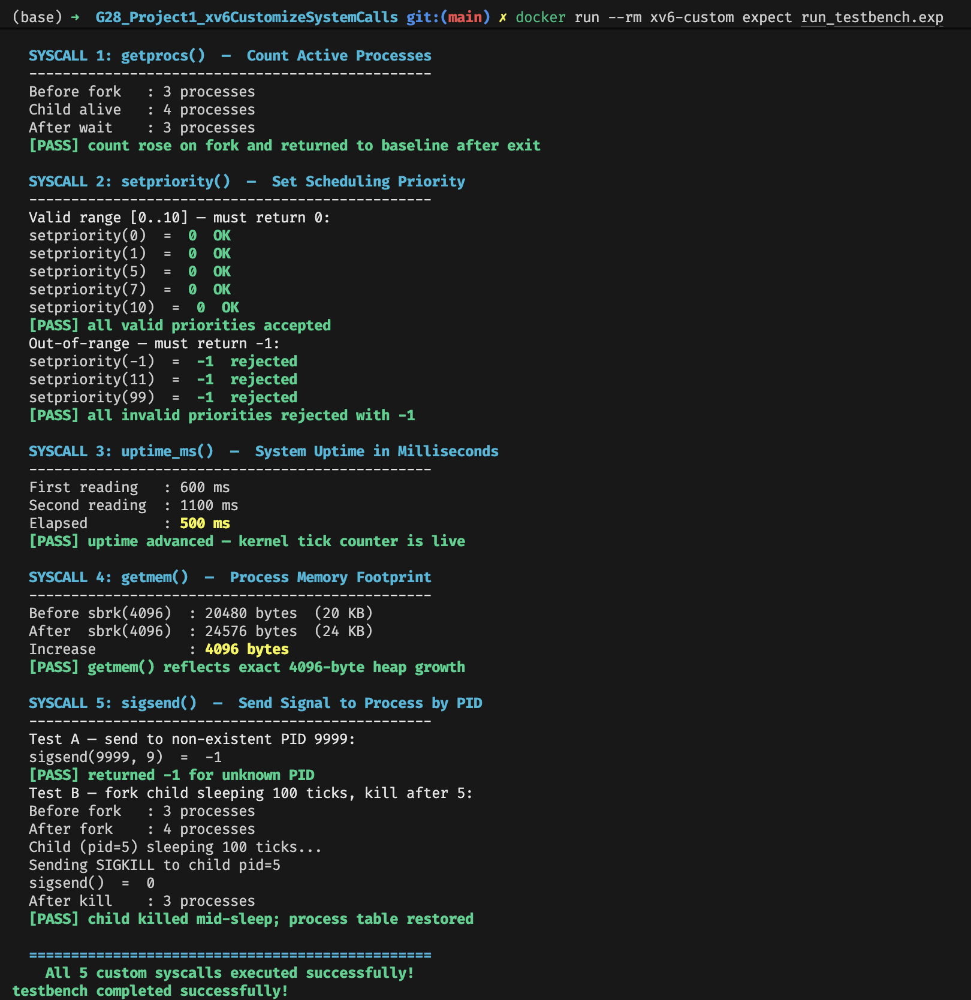

# xv6 Custom System Calls — Group 28

---

## Implemented System Calls

| # | Name | Description |
|---|------|-------------|
| 22 | `getprocs()` | Returns the number of currently active processes |
| 23 | `setpriority(int)` | Sets the calling process's scheduling priority (0–10) |
| 24 | `sigsend(int pid, int sig)` | Sends a signal to a process by PID |
| 25 | `uptime_ms()` | Returns system uptime in milliseconds |
| 26 | `getmem()` | Returns the calling process's memory footprint in bytes |

---

## How It Works

Each syscall follows the standard xv6 path:

1. **User space** — `user/user.h` declares the prototype. `user/usys.pl` generates a RISC-V assembly stub that loads the syscall number into register `a7` and executes `ecall`.
2. **Trap** — The CPU traps to the kernel. `kernel/syscall.c` reads `a7` and dispatches to the correct handler via the `syscalls[]` table.
3. **Kernel handler** — `kernel/sysproc.c` contains the implementation. Results are placed in `a0` and returned to user space.

### Files modified in xv6

| File | Change |
|------|--------|
| `kernel/syscall.h` | Added `#define SYS_getprocs 22` … `SYS_getmem 26` |
| `kernel/proc.h` | Added `int priority` field to `struct proc` |
| `kernel/proc.c` | Initialised `p->priority = 0` in `allocproc()` |
| `kernel/syscall.c` | Added extern declarations + dispatch table entries |
| `kernel/sysproc.c` | Appended all 5 kernel-side implementations |
| `user/user.h` | Appended 5 user-space prototypes |
| `user/usys.pl` | Appended 5 `entry()` calls for assembly stub generation |
| `Makefile` | Added `$U/_testbench` to `UPROGS` |

---

## Build & Run

**Prerequisite:** Docker

```bash
# Build (first time takes ~3 min; cached after that)
docker build -t xv6-custom .

# Run automated demo
docker run --rm xv6-custom expect run_testbench.exp

# Interactive xv6 shell
docker run -it xv6-custom
# At the '$' prompt: testbench
# To quit QEMU: Ctrl-A then X
```

---

## Demo Output


